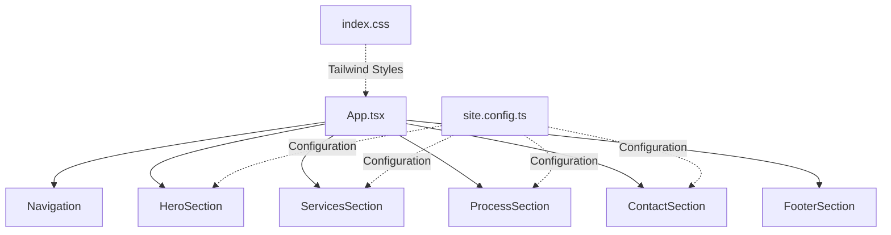

# Steven Web AI Automations

> A modern, responsive landing page for web development and AI automation services

[](./LICENSE)
[](./CHANGELOG.md)
[](#)

## Table of Contents

- [Overview](#overview)
- [Features](#features)
- [Architecture](#architecture)
- [Tech Stack](#tech-stack)
- [Getting Started](#getting-started)
  - [Prerequisites](#prerequisites)
  - [Installation](#installation)
  - [Configuration](#configuration)
  - [Development](#development)
  - [Building](#building)
- [Project Structure](#project-structure)
- [Quality](#quality)
- [Deployment](#deployment)
- [Roadmap](#roadmap)
- [Contributing](#contributing)
- [Security](#security)
- [License](#license)
- [FAQ](#faq)

## Overview

This is a professional landing page built with React, TypeScript, and Vite. It showcases web development and AI automation services with a clean, modern interface optimized for conversions and user experience.

The site features a responsive design, smooth animations, and a configuration-driven architecture that makes content updates straightforward.

<!-- Screenshot placeholder - add optimized screenshot here -->
<!--  -->

## Features

- **Responsive Design** - Mobile-first approach with breakpoints for tablet and desktop
- **Type-Safe Configuration** - Centralized site config with TypeScript for content management
- **Modern UI/UX** - Clean aesthetic with custom color palette and typography
- **Performance Optimized** - Vite-powered build with code splitting and lazy loading
- **Accessible** - Semantic HTML and ARIA attributes for screen reader compatibility
- **Easy Deployment** - Static build ready for any hosting platform (Vercel, Netlify, GitHub Pages)

## Architecture

The application follows a component-based architecture with clear separation of concerns:



**Key Architecture Decisions:**

- **Configuration-driven content**: All text, links, and service details live in `site.config.ts`
- **Component isolation**: Each section is self-contained for easy maintenance
- **Styling approach**: Tailwind CSS utility classes with custom theme extensions
- **Build optimization**: Vite handles HMR in development and optimized production builds

See [docs/architecture.md](./docs/architecture.md) for detailed architecture documentation.

## Tech Stack

### Frontend
- **React** 18.3.1 - UI component library
- **TypeScript** 5.5.3 - Type safety and developer experience
- **Vite** 5.4.2 - Build tool and development server

### Styling
- **Tailwind CSS** 3.4.1 - Utility-first CSS framework
- **PostCSS** 8.4.35 - CSS processing and autoprefixing
- **Lucide React** 0.344.0 - Icon library

### Development Tools
- **ESLint** 9.9.1 - Code linting and quality
- **TypeScript ESLint** 8.3.0 - TypeScript-specific linting rules

## Getting Started

### Prerequisites

Ensure you have the following installed:

- **Node.js** >= 18.0.0
- **npm** >= 9.0.0 (or **pnpm** >= 8.0.0)

### Installation

Clone the repository and install dependencies:

```bash
# Clone repository
git clone https://github.com/slaw469/web-funnel-1.git
cd web-funnel-1

# Install dependencies
npm install
# or
pnpm install
```

### Configuration

Update `src/site.config.ts` with your information:

| Variable | Type | Description | Default |
|----------|------|-------------|---------|
| `brand` | string | Site title and brand name | "Steven Law — Web & AI Automations" |
| `tagline` | string | Hero section tagline | "Websites & AI Automations that Actually Ship." |
| `description` | string | Site meta description | "I design, build, and automate..." |
| `calendly` | string | Calendly scheduling link | (see config file) |
| `linkedin` | string | LinkedIn profile URL | (see config file) |
| `portfolio` | string | GitHub or portfolio URL | (see config file) |
| `email` | string | Contact email address | **Update required** |
| `services` | array | List of service offerings | (see config file) |
| `process` | array | Process steps | (see config file) |

**Important:** Replace placeholder email addresses before deploying to production.

### Development

Start the development server:

```bash
npm run dev
```

The application will be available at `http://localhost:5173`

Features enabled in dev mode:
- Hot Module Replacement (HMR)
- Source maps for debugging
- Fast refresh for React components

### Building

Create a production build:

```bash
npm run build
```

Output directory: `dist/`

Preview the production build locally:

```bash
npm run preview
```

## Project Structure

```
web-funnel-1/
├── src/
│   ├── components/       # React components
│   │   ├── Navigation.tsx
│   │   ├── HeroSection.tsx
│   │   ├── ServicesSection.tsx
│   │   ├── ProcessSection.tsx
│   │   ├── ContactSection.tsx
│   │   └── FooterSection.tsx
│   ├── assets/           # Static assets (images, etc.)
│   ├── App.tsx           # Root component
│   ├── main.tsx          # Application entry point
│   ├── index.css         # Global styles & Tailwind imports
│   └── site.config.ts    # Site configuration
├── public/               # Public static files
├── docs/                 # Documentation
├── dist/                 # Build output (generated)
├── index.html            # HTML template
├── vite.config.ts        # Vite configuration
├── tailwind.config.js    # Tailwind configuration
├── tsconfig.json         # TypeScript configuration
└── package.json          # Dependencies and scripts
```

## Quality

### Linting

Run ESLint to check code quality:

```bash
npm run lint
```

### Type Checking

Verify TypeScript types:

```bash
npx tsc --noEmit
```

### Code Formatting

Format code with Prettier (recommended to set up):

```bash
npx prettier --write "src/**/*.{ts,tsx}"
```

## Deployment

### Vercel (Recommended)

1. Install Vercel CLI:
   ```bash
   npm install -g vercel
   ```

2. Deploy:
   ```bash
   vercel
   ```

3. For production:
   ```bash
   vercel --prod
   ```

**Configuration**: Vercel auto-detects Vite projects. No additional config needed.

### Netlify

1. Build command: `npm run build`
2. Publish directory: `dist`
3. Deploy via Netlify CLI or Git integration

### GitHub Pages

1. Update `vite.config.ts` to set base path:
   ```typescript
   export default defineConfig({
     base: '/web-funnel-1/',
     // ... other config
   })
   ```

2. Build and deploy:
   ```bash
   npm run build
   npx gh-pages -d dist
   ```

See [docs/deployment.md](./docs/deployment.md) for detailed deployment guides.

## Roadmap

- **Q4 2025**: Implement testing suite (Vitest + React Testing Library)
- **Q4 2025**: Add CI/CD pipeline with GitHub Actions
- **Q1 2026**: Integrate analytics (privacy-focused)
- **Q1 2026**: Add blog/case studies section
- **Q1 2026**: Internationalization (i18n) support

## Contributing

Contributions are welcome! Please read our [Contributing Guidelines](./CONTRIBUTING.md) before submitting pull requests.

**Quick Start for Contributors:**
1. Fork the repository
2. Create a feature branch: `git checkout -b feature/your-feature`
3. Commit changes using Conventional Commits: `feat: add new feature`
4. Push and create a Pull Request

## Security

Security is important. If you discover a vulnerability, please report it privately.

See our [Security Policy](./SECURITY.md) for details on reporting vulnerabilities.

## License

This project is licensed under the MIT License - see the [LICENSE](./LICENSE) file for details.

**Copyright © 2025 Steven Law**

## FAQ

### Q: Can I use this as a template for my own landing page?

Yes! This project is MIT licensed. Fork it, customize `site.config.ts`, update colors in `tailwind.config.js`, and deploy.

### Q: How do I change the color scheme?

Edit `tailwind.config.js` and update the `colors` section in `theme.extend`. The primary colors are `primary` and custom purple shades.

### Q: Where do I update contact information?

All contact details are in `src/site.config.ts`. Update the `email`, `linkedin`, `calendly`, and `portfolio` fields.

### Q: How do I add more services?

Edit the `services` array in `src/site.config.ts`. Each service has a `title`, `value` (description), and `bullets` (optional list).

### Q: Is this SEO optimized?

Basic SEO is in place via meta tags in `index.html`. For advanced SEO, consider adding:
- `react-helmet` for dynamic meta tags
- Sitemap generation
- Open Graph tags
- Structured data (JSON-LD)

### Q: Can I add a blog?

Yes, but you'll need to add a routing solution (React Router) and a content management approach (Markdown + frontmatter, or a headless CMS). See the roadmap for planned features.

---

**Built with ❤️ using React, TypeScript, and Vite**

